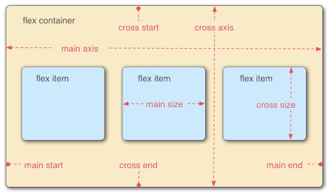

## 一、Flex布局是什么？

`Flex`是`Flexible Box`的缩写，意为”弹性布局”，用来为盒状模型提供最大的灵活性。

任何一个容器都可以指定为`Flex`布局（行内元素也可以）。


## 二、基本概念

采用`Flex`布局的元素，称为`Flex`容器（`flex container`），简称”容器”。它的所有子元素自动成为容器成员，称为`Flex`项目（`flex item`），简称”项目”



容器默认存在两根轴：水平的主轴（`main axis`）和垂直的交叉轴（`cross axis`）。主轴的开始位置（与边框的交叉点）叫做`main start`，结束位置叫做`main end`；交叉轴的开始位置叫做`cross start`，结束位置叫做`cross end`。

项目默认沿主轴排列。单个项目占据的主轴空间叫做`main size`，占据的交叉轴空间叫做`cross size`。


## 三、容器的属性

以下6个属性设置在容器上。

* flex-direction

* flex-wrap

* flex-flow

* justify-content

* align-items

* align-content


### 3.1 flex-direction属性

`flex-direction`属性决定主轴的方向（即项目的排列方向）。

```
.box {  flex-direction: row | row-reverse | column | column-reverse;}
```


### 3.2 flex-wrap属性

默认情况下，项目都排在一条线（又称”轴线”）上。`flex-wrap`属性定义，如果一条轴线排不下，如何换行。

```
.box{ flex-wrap: nowrap | wrap | wrap-reverse;}

```


### 3.3 flex-flow

`flex-flow`属性是`flex-direction`属性和`flex-wrap`属性的简写形式，默认值为`row nowrap`。

```
.box {  flex-flow: row nowrap ;}

```


### 3.4 justify-content属性

`justify-content`属性定义了项目在主轴上的对齐方式。


```
.box {  justify-content: flex-start | flex-end | center | space-between | space-around;}

```


### 3.5 align-items属性

`align-items`属性定义项目在交叉轴上如何对齐。

```
.box {  align-items: flex-start | flex-end | center | baseline | stretch;}
```

它可能取5个值。具体的对齐方式与交叉轴的方向有关，下面假设交叉轴从上到下。

* flex-start：交叉轴的起点对齐。

* flex-end：交叉轴的终点对齐。

* center：交叉轴的中点对齐。

* baseline: 项目的第一行文字的基线对齐。

* stretch（默认值）：如果项目未设置高度或设为auto，将占满整个容器的高度。


### 3.6 align-content属性

`align-content`属性定义了多根轴线的对齐方式。如果项目只有一根轴线，该属性不起作用。

```
.box {  align-content: flex-start | flex-end | center | space-between | space-around | stretch;}
```


## 四、项目的属性

以下6个属性设置在项目上。

* order

* flex-grow

* flex-shrink

* flex-basis

* flex

* align-self


### 4.1 order属性

`order`属性定义项目的排列顺序。数值越小，排列越靠前，默认为0。

```
.item {  order: ;}
```


### 4.2 flex-grow属性

`flex-grow`属性定义项目的放大比例，默认为0，即如果存在剩余空间，也不放大。

```
.item {  flex-grow: ; /* default 0 */}
```


### 4.3 flex-shrink属性

`flex-shrink`属性定义了项目的缩小比例，默认为1，即如果空间不足，该项目将缩小。

```
.item {  flex-shrink: ; /* default 1 */}
```


### 4.4 flex-basis属性

`flex-basis`属性定义了在分配多余空间之前，项目占据的主轴空间（`main size`）。浏览器根据这个属性，计算主轴是否有多余空间。它的默认值为`auto`，即项目的本来大小。

```
.item {  flex-basis: | auto; /* default auto */}
```


### 4.5 flex属性

`flex`属性是`flex-grow`, `flex-shrink` 和 `flex-basis`的简写，默认值为`0 1 auto`。后两个属性可选。

```
.item {  flex: none | [ <'flex-grow'> <'flex-shrink'>? || <'flex-basis'> ]}
```

>该属性有两个快捷值：auto (1 1 auto) 和 none (0 0 auto)。

>建议优先使用这个属性，而不是单独写三个分离的属性，因为浏览器会推算相关值。


### 4.6 align-self属性

`align-self`属性允许单个项目有与其他项目不一样的对齐方式，可覆盖`align-items`属性。默认值为`auto`，表示继承父元素的`align-items`属性，如果没有父元素，则等同于`stretch`。

```
.item {  align-self: auto | flex-start | flex-end | center | baseline | stretch;}
```


### 五、尝试

```
<!DOCTYPE html>
<html lang="en">

<head>
    <meta charset="UTF-8">
    <meta name="viewport" content="width=device-width, initial-scale=1.0">
    <meta http-equiv="X-UA-Compatible" content="ie=edge">
    <title>Document</title>
    <style>
        * {
            border: 0px;
            padding: 0px;
            margin: 0px;
        }

        .main {
            display: flex;
            height: 100vh;
            /* flex-direction: row;
            flex-wrap: wrap-reverse; */
            flex-flow: row wrap-reverse;
            /* flex-flow: row nowrap;
            align-items: center ; */
            justify-content: space-around;
            align-content: center;
        }


        .main div:first-child,
        .main div:last-child {
            height: 100px;
        }

        .main div {
            height: 200px;
            width: 100px;
            border: 1px solid red;

        }
    </style>
</head>

<body>
    <div class="main">
        <div>1</div>
        <div>2</div>
        <div>3</div>
        <div>4</div>
        <div>5</div>
        <div>6</div>
        <div>7</div>
        <div>8</div>
        <div>9</div>
        <div>10</div>
        <div>11</div>
        <div>12</div>
        <div>13</div>
        <div>14</div>
        <div>15</div>
        <div>16</div>
        <div>17</div>
        <div>18</div>
        <div>19</div>
    </div>
</body>

</html>
```