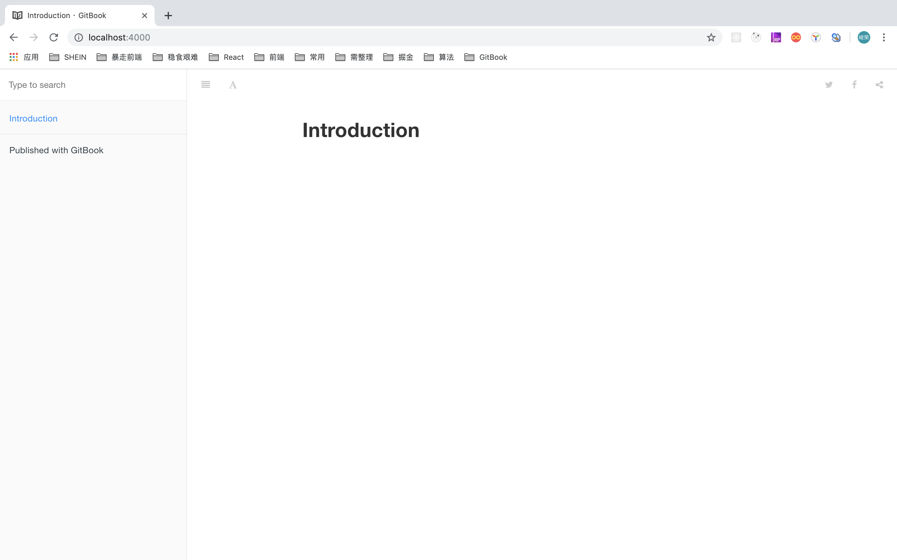

#GitBook 初始化

> `gitbook`是基于 `node.js`的命令工具，,首先需要安装并配置好`node.js` 环境,然后才能安装`gitbook` 相关工具.


## 1. gitbook 环境预检查

###1.1 git 环境

`git`  是免费开源的分布式版本控制系统,主要用于电子书的更新管理和团队协作,如果不需要将电子书托管到`github` 网站上,则可以不安装 `git` .
如果打印出 `git` 版本信息,则表示本机已安装 `git` 环境,跳过此步骤.

`$ git --version`
>  `git` 安装配置教程请参考[初识 git](https://snowdreams1006.github.io/git/base/about.html)


### 1.2 node.js 环境
`node.js` 是 `js` 在服务端运行的环境基础,从而使得 `js` 从浏览器端延伸到服务端领域,而 `gitbook` 则是运行在 `node.js` 基础之上的命令行工具,因此必须先安装好 `node.js` 开发环境.

如果打印出 `node.js` 版本信息,则表示本机已安装 `node.js` 环境,跳过此步骤.

`$ node -v`
> `node.js` 安装配置教程请参考 [node](https://nodejs.org/)


## 2. gitbook 安装

### 2.1 `gitbook-cli`安装

`gitbook-cli` 是 `gitbook` 的脚手架工具,帮助我们更方便构建 `gitbook` 应用,当然也可以直接安装 `gitbook` ,只不过那样的话,略显麻烦,不推荐.


```
mac 上执行

$ sudo npm install -g gitbook-cli


window 上执行

$sudo npm install -g gitbook-cli

```

安装成功后会带有 `gitbook` 命令,现在再次运行下 `gitbook -V` 查看版本信息.

```
# 打印出 `CLI` 和 `GitBook` 版本信息即可,安装版本可能已经大于 `2.3.2`
$ gitbook -V
CLI version: 2.3.2
GitBook version: 3.2.3
```


### 2.2 安装 GitBook Editor
`gitbook `官方客户端编辑器,支持 `windows`, `mac` 和 `linux` ,主要用于可视化编辑文档,组织文档结构.

下载相应平台的 [GitBook Editor](https://legacy.gitbook.com/editor),正常安装即可.


`gitbook` 的使用方法大致可以有三种,而 `GitBook Editor` 编辑器只是其中一种,所以这一步是可选的.

* 使用 gitbook-cli 脚手架提供的各种命令直接在命令行管理 gitbook,适合一定编程经验的软件从业人员.
* 使用 GitBook Editor 编辑器管理 gitbook ,适合无任何编程的文学创作者.
* 使用 gitbook.com 官网在线管理 gitbook ,适合不具备本地开发环境的萌新体验者.


## 3. gitbook命令

### 3.1 常用命令

* 安装 GitBook：npm i gitbook-cli -g
* 初始化 GitBook 项目：gitbook init   
* 安装 GitBook 依赖：gitbook install
* 开启 GitBook 服务：gitbook serve  //gitbook serve --port 2333  指定端口
* 打包 GitBook 项目：gitbook build
* GitBook 命令行查看：gitbook -help
* GitBook 版本查看：gitbook -V

###3.2 目录介绍

当我们执行完 `npm i gitbook-cli -g` 后，就开始进行gitbook开发，找一个空文件夹，初始化一个 `GitBook` 项目：`gitbook init`，目录会生成一个 `README.md` 内容文件和一个 `SUMMARY.md` 目录文件如下。

```
- GitBook
 - README.md
 - SUMMARY.md
```
> SUMMARY.md
> \[链接\](链接地址) 表示跳转链接，即 GitBook 会根据你的 SUMMARY 自动帮你生成左侧菜单栏的目录


> README.md
> 书写文档，在SUMMARY中显示

最后，我们在 终端 输入 `gitbook serve` 即可开启一个 `localhost:4000` 的服务，请在浏览器中输入 `http://localhost:4000` 即可访问服务。




## 4. 总结
gitbook 基于 node.js 开发环境,因此首先要安装好 nodejs 环境,其次再使用 node.js 提供的 npm 包管理工具来安装 gitbook.
只需运行 sudo npm install -g gitbook-cli 即可安装,接着运行 gitbook -V 查看安装版本信息确认已经安装成功.
至此 gitbook 的必要开发环境已经准备妥当,接下来让我们赶紧体验一下 gitbook 的魅力吧!


