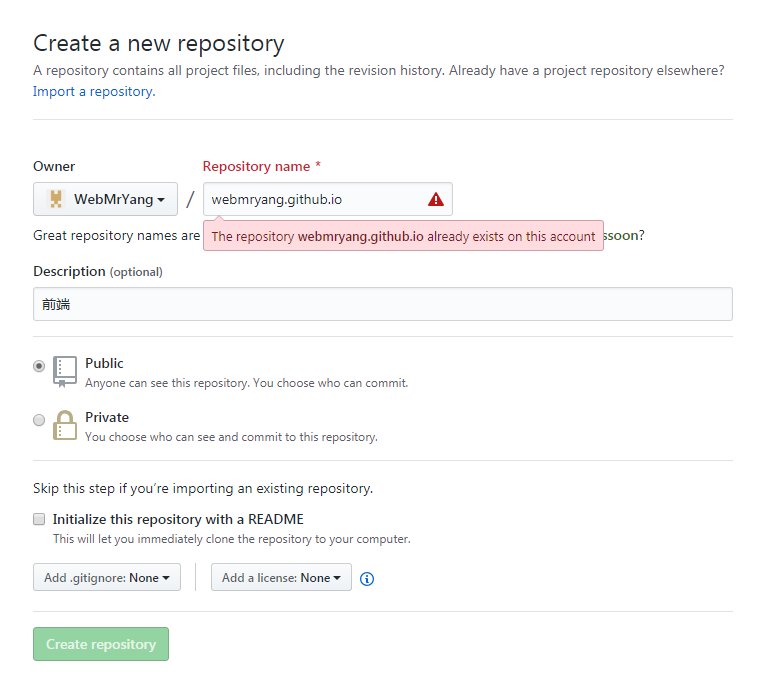
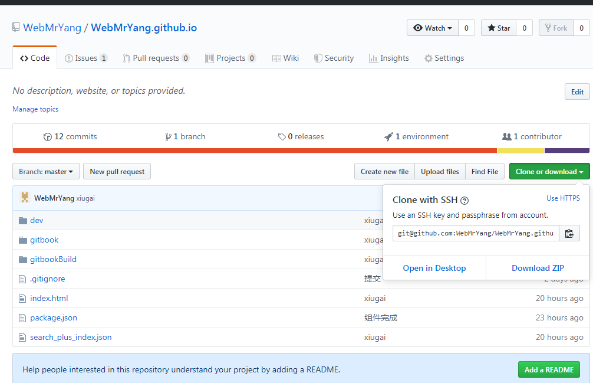
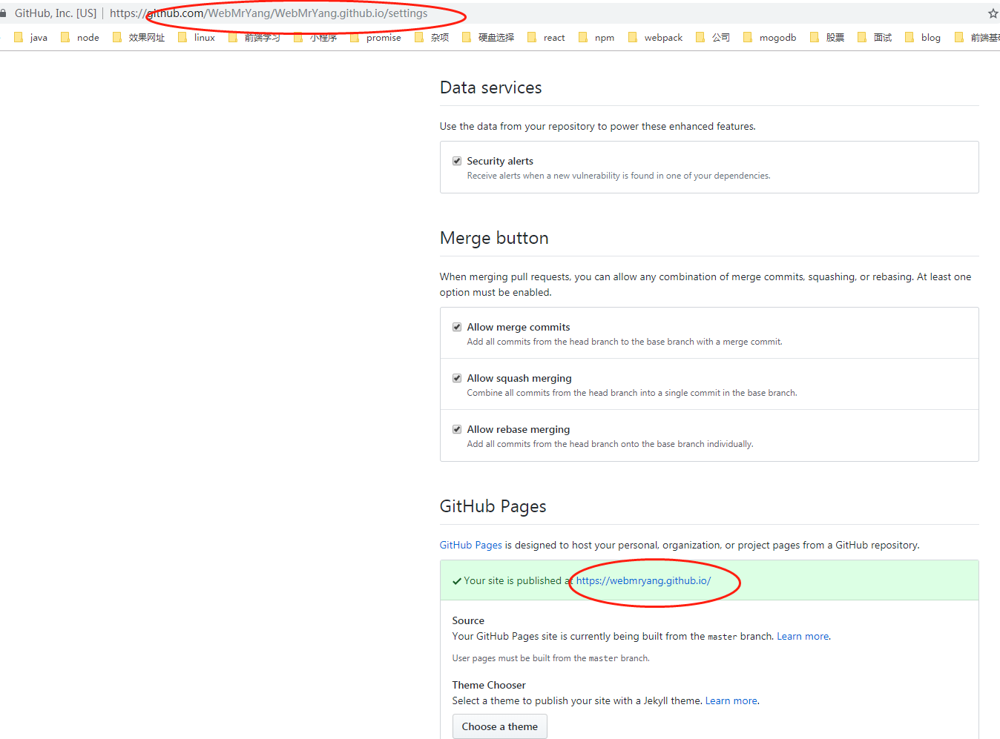

#GitHub 学习


## 1. 什么是 GitHub Pages？

`GitHub Pages` 是一个通过 `GitHub` 项目/仓库 进行部署的，以 `username.github.io` 的形式生成用户的托管平台。

通过 `GitHub Pages`，用户只需要把自己的内容在本地编辑好，然后推送到 GitHub 仓库即可。


## 2. github pages好处

* 使用零成本: `github pages` 集成在 `github` 中, 直接和代码管理绑定在一起, 随着代码更新自动重新部署, 使用非常方便.
* 免费: 免费提供 `username.github.io` 的域名, 免费的静态网站服务器.
* 无数量限制: `github pages` 没有使用的数量限制, 每一个 `github repository` 都可以部署为一个静态网站.


## 3. 搭建


### 3.1 新建仓库

打开 GitHub 页面，注册号用户后，新建仓库（`New repository`），在仓库名（`Repository name`）中输入 `username.github.io`，例如 `webmryang` 的就是：`webmryang.github.io`，然后点击 `Create repository` 即可创建一个部署好的环境。(用户名大小生成网址时都是小写)




### 3.2 Clone 项目

clone项目到本地：



下载的时候选择ssh下载，可以配置ssh免密登录


### 3.3 上传项目到 GitHub

在项目中加入一个html页面执行一下操作：


    ```
        git add .
        git commit -m 'github'
        git push

    ```


### 3.4  打开 `用户名.github.io`

打开 `用户名.github.io`


### 3.5 查看Settings

在`settings`中也可以查看项目在网站上的真实的网址




