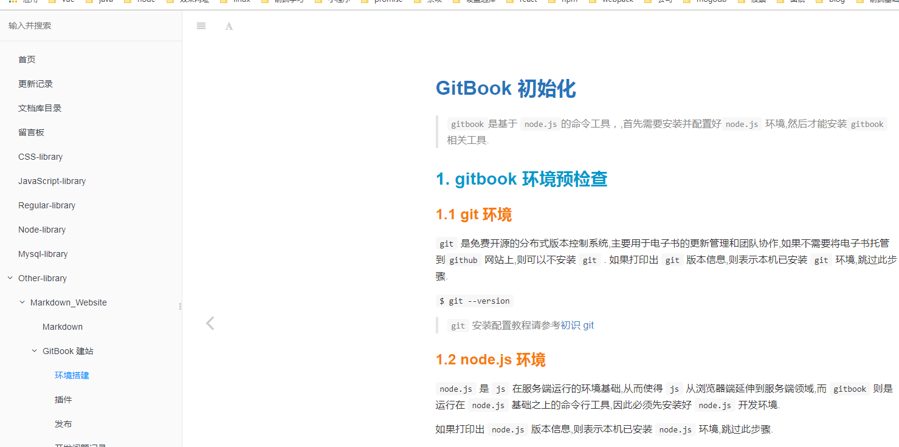

# 发布

已经写好项目，就可以进行打包，发布了

* HTML:`gitbook build [书籍路径] [输出路径]`
* PDF: `gitbook pdf ./ ./mybook.pdf`
* epub `gitbook epub ./ ./mybook.epub`
* mobi `gitbook mobi ./ ./mybook.mobi`

然后，部署到 GitHub([教程](../GitHub/README.md)) 上了。

最后，我们查看下我们的部署页面([地址](https://webmryang.github.io/))：

