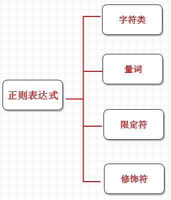

#正则

## 1. 概念

正则表达式是对字符串操作的一种逻辑公式，就是用事先定义好的一些特定字符、及这些特定字符的组合，组成一个“规则字符串”，这个“规则字符串”用来表达对字符串的一种过滤逻辑。

## 2. 正则目的

* 1. 给定的字符串是否符合正则表达式的过滤逻辑（称作“匹配”）；
* 2. 可以通过正则表达式，从字符串中获取我们想要的特定部分。

## 3. 正则特点

* 1. 灵活性、逻辑性和功能性非常的强；
* 2. 可以迅速地用极简单的方式达到字符串的复杂控制。
* 3. 对于刚接触的人来说，比较晦涩难懂。

## 4. 正则的组成

## 5. 参考资料

1. 了解正则的运行情况可以使用正则工具 [地址](https://regexper.com/)
2. 正则视频可以查看[慕课网](https://www.imooc.com/learn/706)
3. [正则初识（一）规则](https://www.jianshu.com/p/39030fd8fde4)
4. [Linux--shell脚本之正则表达式](https://www.cnblogs.com/hanxiaoyu/p/5759477.html)

