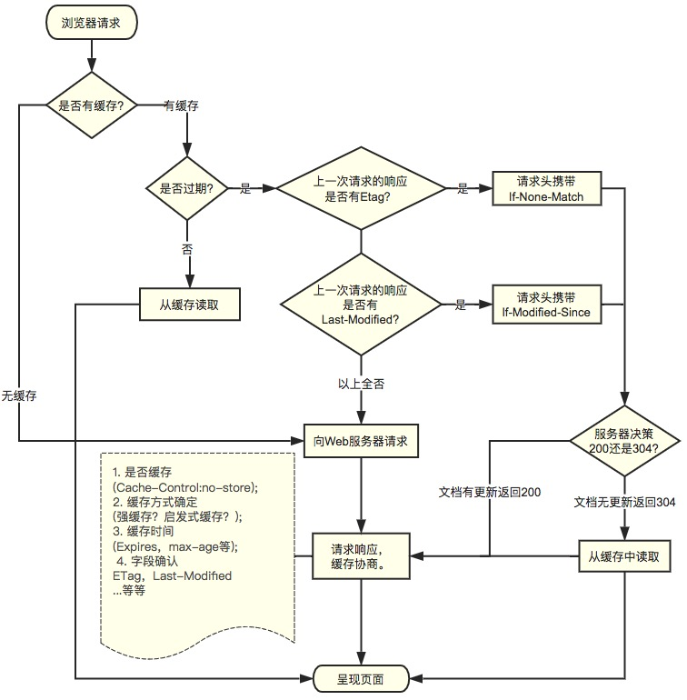

# HTTP缓存

## 一、介绍

`Http` 缓存机制作为 `web` 性能优化的重要手段，对于从事 `Web` 开发的同学们来说，应该是知识体系库中的一个基础环节，同时对于有志成为前端架构师的同学来说是必备的知识技能。

在介绍 `HTTP` 缓存之前，先简单介绍一下HTTP报文

`HTTP` 报文就是浏览器和服务器间通信时发送及响应的数据块。

浏览器向服务器请求数据，发送请求(`request`)报文；服务器向浏览器返回数据，返回响应(`response`)报文。

报文信息主要分为两部分

* 1. 包含属性的首部(header)--------------------------附加信息（cookie，缓存信息等）与缓存相关的规则信息，均包含在header中
* 2. 包含数据的主体部分(body)-----------------------HTTP请求真正想要传输的部分

## 二、 缓存分类

`HTTP` 缓存有多种规则，根据是否需要重新向服务器发起请求来分类，我将其分为两大类(强制缓存，对比缓存）两类缓存规则可以同时存在，强制缓存优先级高于对比缓存，也就是说，当执行强制缓存的规则时，如果缓存生效，直接使用缓存，不再执行对比缓存规则。

### 2.1 强制缓存

强制缓存（状态码还是200）命中强缓存时，浏览器并不会将请求发送给服务器。在 `Chrome` 的开发者工具中看到 `http` 的返回码是200，但是在 Size 列会显示为(from cache)。

对于强制缓存来说，响应 `header` 中会有两个字段来标明失效规则（Expires/Cache-Control）

使用 `chrome` 的开发者工具，可以很明显的看到对于强制缓存生效时，网络请求的情况

* **Expires**

`Expires` 的值为服务端返回的到期时间，即下一次请求时，请求时间小于服务端返回的到期时间，直接使用缓存数据。

不过 `Expires` 是` HTTP 1.0 `的东西，现在默认浏览器均默认使用 `HTTP 1.1`，所以它的作用基本忽略。

另一个问题是，到期时间是由服务端生成的，但是客户端时间可能跟服务端时间有误差，这就会导致缓存命中的误差。

所以` HTTP 1.1` 的版本，使用 `Cache-Control` 替代。

* **Cache-Control**

`Cache-Control` 是最重要的规则。常见的取值有 `private` `、public` 、`no-cache ` 、`max-age` ，`no-store`，默认为 `private` 。

 *   private: 客户端可以缓存
 *   public: 客户端和代理服务器都可缓存（前端的同学，可以认为public和private是一样的）
 *   max-age=xxx: 缓存的内容将在 xxx 秒后失效
 *   no-cache: 需要使用对比缓存来验证缓存数据（后面介绍）
 *   no-store: 所有内容都不会缓存，强制缓存，对比缓存都不会触发（对于前端开发来说，缓存越多越好，so...基本上和它说886）

### 2.2 对比缓存

对比缓存（状态码还是304）对比缓存，顾名思义，需要进行比较判断是否可以使用缓存。

浏览器第一次请求数据时，服务器会将缓存标识与数据一起返回给客户端，客户端将二者备份至缓存数据库中。

再次请求数据时，客户端将备份的缓存标识发送给服务器，服务器根据缓存标识进行判断，判断成功后，返回304状态码，通知客户端比较成功，可以使用缓存数据。

`Last-Modified`  /  `If-Modified-Since`

* **Last-Modified：**

浏览器第一次请求一个资源的时候，服务器返回的 `header` 中会加上 `Last-Modify`，`Last-modify` 是一个时间标识该资源的最后修改时间

* **If-Modified-Since：**

再次请求服务器时，通过此字段通知服务器上次请求时，服务器返回的资源最后修改时间。

服务器收到请求后发现有头 `If-Modified-Since` 则与被请求资源的最后修改时间进行比对。

若资源的最后修改时间大于 `If-Modified-Since` ，说明资源又被改动过，则响应整片资源内容，返回状态码200；

若资源的最后修改时间小于或等于 `If-Modified-Since` ，说明资源无新修改，则响应 `HTTP 304`，告知浏览器继续使用所保存的cache。

`Etag`  /  `If-None-Match`（优先级高于` Last-Modified`  /  `If-Modified-Since` ）

* **ETag(resp)/If-None-Match（req）**

与 `Last-Modify`/`If-Modify-Since`不同的是，`Etag`/`If-None-Match`返回的是一个校验码（ETag: entity `tag）。ETag` 可以保证每一个资源是唯一的，资源变化都会导致ETag变化*。ETag值的变更则说明资源状态已经被修改。服务器根据浏览器上发送的 `If-None-Match` 值来判断是否命中缓存。

## 三、 总结

对于强制缓存，服务器通知浏览器一个缓存时间，在缓存时间内，下次请求，直接用缓存，不在时间内，执行比较缓存策略。

对于比较缓存，将缓存信息中的 `Etag` 和 `Last-Modified` 通过请求发送给服务器，由服务器校验，返回304状态码时，浏览器直接使用缓存。

