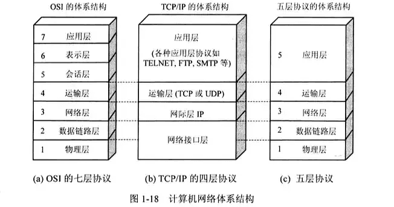
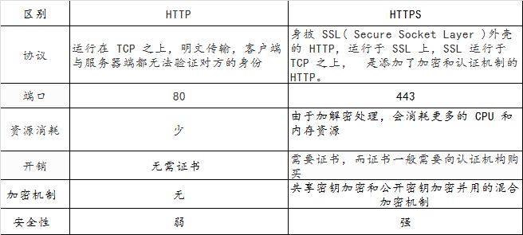
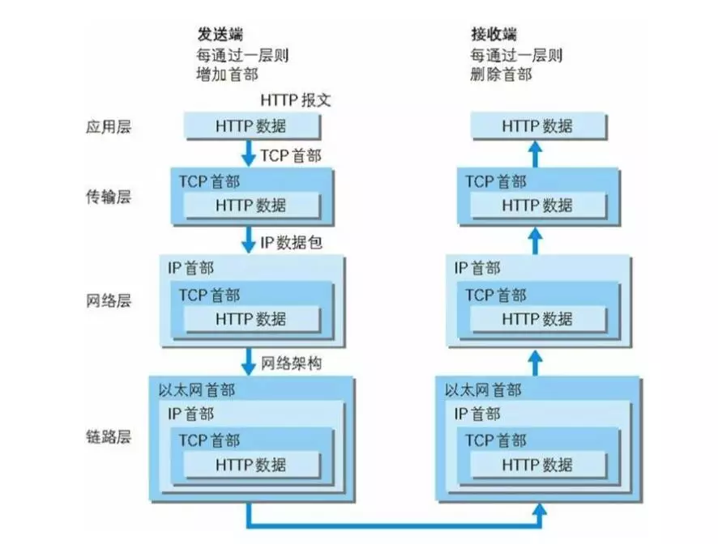
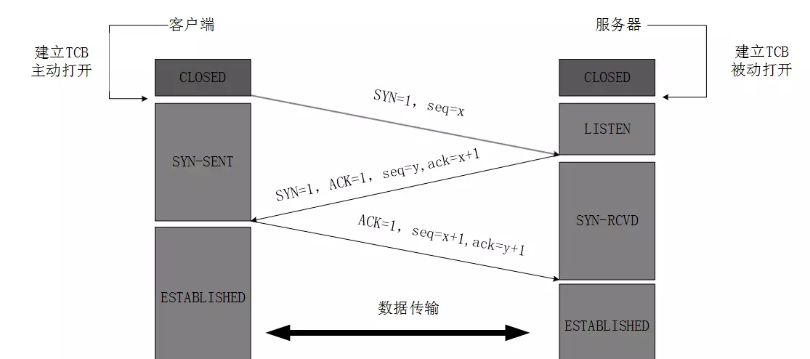
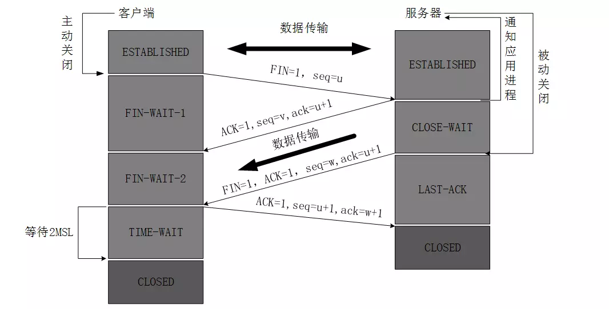
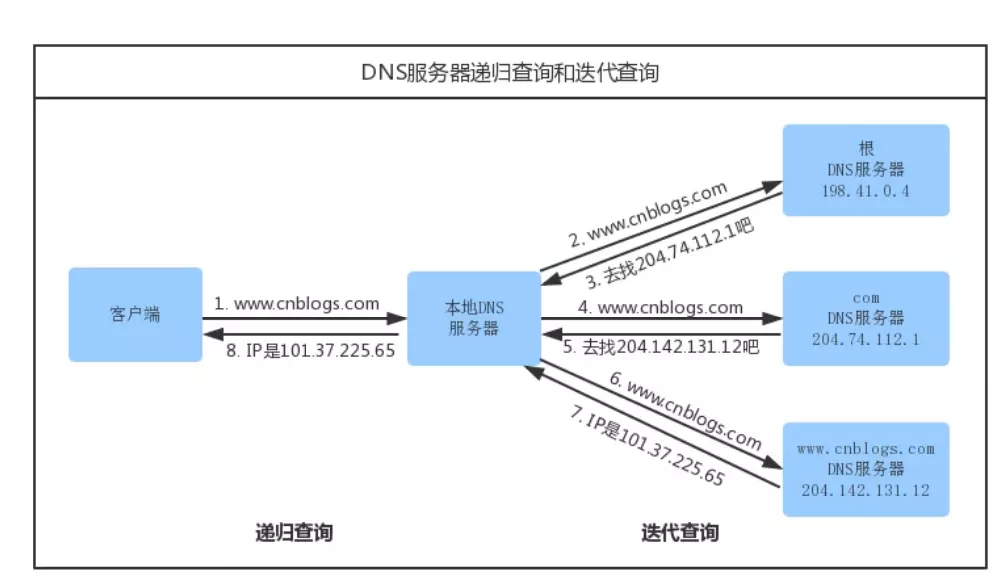

#TCP 通信

## 一、 OSI 七层协议模型、TCP/IP 四层模型各层对应

## 二、HTTP 与 HTTPS 的区别

## 三 、TCP/IP 通信传输流

发送端在层与层之间传输数据时，每经过一层必定会加上一个该层的首部信息。反之，接收端在层与层之间传输数据时，每经过一层会把相关的首部信息去掉。

##  四、TCP 三次握手和四次挥手

>TCP（Transmission Control Protocol 传输控制协议）是一种面向连接的、可靠的、基于字节流的传输层通信协议。

### 三次握手

###### 第一次握手：
建立连接时，向服务器发出连接请求报文，客户端进程进入已发送状态状态,等待服务器确认；

######第二次握手：
服务器收到请求后，如果同意连接，则发出确认报文，此时服务器进程进入了 同步收到状态；

######第三次握手：
客户端收到服务器的确认报文后，要向服务器给出确认，此时，TCP 连接建立，客户端进入已建立连接状态。

完成三次握手，客户端与服务器开始传送数据。

>建立一个连接需要三次握手，而终止一个连接要经过四次握手，这是由 TCP 的半关闭（half-close）造成的。

### 四次挥手

**第一次挥手：**
客户端进程发出连接释放报文，并且停止发送数据。释放数据报文首部 FIN=1，其序列号为 seq = u（等于前面已经传送过来的数据的最后一个字节的序号加1），此时，客户端进入 FIN-WAIT-1（终止等待1）状态。

**第二次挥手：**
服务器收到连接释放报文，发出确认报文，ACK = 1，ack = u + 1，并且带上自己的序列号 seq = v，此时，服务端就进入了 CLOSE-WAIT（关闭等待）状态。

> TCP 服务器通知高层的应用进程，客户端向服务器的方向就释放了，这时候处于半关闭状态，即客户端已经没有数据要发送了，但是服务器若发送数据，客户端依然要接受。这个状态还要持续一段时间，也就是整个 CLOSE-WAIT 状态持续的时间。
> 客户端收到服务器的确认请求后，此时，客户端就进入 FIN-WAIT-2（终止等待2）状态，等待服务器发送连接释放报文（在这之前还需要接受服务器发送的最后的数据）。

**第三次挥手：**
服务器将最后的数据发送完毕后，就向客户端发送连接释放报文，FIN = 1，ack = u + 1，由于在半关闭状态，服务器很可能又发送了一些数据，假定此时的序列号为 seq = w，此时，服务器就进入了 LAST-ACK（最后确认）状态，等待客户端的确认。 **第四次挥手：**
客户端收到服务器的连接释放报文后，必须发出确认，ACK = 1，ack = w + 1，而自己的序列号是 seq = u + 1，此时，客户端就进入了 TIME-WAIT（时间等待）状态。

> 注意此时 TCP 连接还没有释放，必须经过 2MSL（最长报文段寿命）的时间后，当客户端撤销相应的 TCB 后，才进入 CLOSED 状态。

服务器只要收到了客户端发出的确认，立即进入 CLOSED 状态。同样，撤销 TCB 后，就结束了这次的 TCP 连接。

> 可以看到，服务器结束 TCP 连接的时间要比客户端早一些。

#### 四次的原因

这是因为服务端的 LISTEN 状态下的 SOCKET 当收到 SYN 报文的建连请求后，它可以把 ACK 和 SYN（ACK 起应答作用，而 SYN 起同步作用）放在一个报文里来发送。 但关闭连接时，当收到对方的 FIN 报文通知时，它仅仅表示对方没有数据发送给你了；但未必你所有的数据都全部发送给对方了，所以你未必会马上会关闭 SOCKET ,也即你可能还需要发送一些数据给对方之后，再发送 FIN 报文给对方来表示你同意现在可以关闭连接了，所以它这里的 ACK 报文和 FIN 报文多数情况下都是分开发送的.

> 由于 TCP 连接是全双工的，因此每个方向都必须单独进行关闭。这个原则是当一方完成它的数据发送任务后就能发送一个 FIN 来终止这个方向的连接。收到一个 FIN 只意味着这一方向上没有数据流动，一个 TCP 连接在收到一个 FIN 后仍能发送数据。首先进行关闭的一方将执行主动关闭，而另一方执行被动关闭。

## 五、DNS 域名解析 

当你在浏览器的地址栏输入 `https://jianshu.com` 后会发生什么，大家在心中肯定是有一个大概的，这里我将 **DNS 域名解析** 这个步骤详细的讲一遍。在讲概念之前我先放上一张经典的图文供大家思考一分钟。

## 六、查找域名对应的 IP 地址的具体过程

1.  浏览器搜索自己的 DNS 缓存（浏览器维护一张域名与 IP 地址的对应表）；如果没有命中，进入下一步；
2.  搜索操作系统中的 DNS 缓存；如果没有命中，进入下一步；
3.  搜索操作系统的 hosts 文件（ Windows 环境下，维护一张域名与 IP 地址的对应表）；如果没有命中，进入下一步；

> 1.  操作系统将域名发送至 LDNS （本地区域名服务器），LDNS 查询自己的 DNS 缓存（一般命中率在 80% 左右），查找成功则返回结果，失败则发起一个迭代 DNS 解析请求：
> 2.  LDNS向 Root Name Server（根域名服务器，如com、net、im 等的顶级域名服务器的地址）发起请求，此处，Root Name Server 返回 im 域的顶级域名服务器的地址；
> 3.  LDNS 向 im 域的顶级域名服务器发起请求，返回jianshu.com 域名服务器地址；
> 4.  LDNS 向 jianshu.com 域名服务器发起请求，得到jianshu.com 的 IP 地址；
> 5.  LDNS 将得到的 IP 地址返回给操作系统，同时自己也将 IP 地址缓存起来；操作系统将 IP 地址返回给浏览器，同时自己也将 IP 地址缓存起来。

## 七、DNS Prefetch

即 DNS 预获取，是前端优化的一部分。一般来说，在前端优化中与 DNS 有关的有两点：

1.  减少 DNS 的请求次数
2.  进行 DNS 预获取

典型的一次 DNS 解析需要耗费 20-120 毫秒，减少DNS解析时间和次数是个很好的优化方式。DNS Prefetching 是让具有此属性的域名不需要用户点击链接就在后台解析，而域名解析和内容载入是串行的网络操作，所以这个方式能减少用户的等待时间，提升用户体验。

