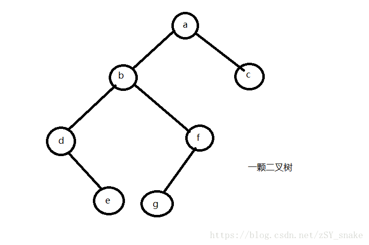

# 二叉树遍历


## 一、 介绍：

所谓二叉树的遍历，是指按照一定的顺序对二叉树的每一个节点均访问一次，且只访问一次。




## 二、方式

按照访问根节点的访问位置不同通常把二叉树的遍历分为三种方式：

前序遍历、中序遍历、后序遍历


## 2.1 前序遍历

首先访问根节点，然后访问根节点的左子树，在访问根节点的右子树。


遍历结果：abdefgc

```
function DLR(tree){
    console.log(tree.value);
    if(tree.left){
        DLR(tree.left);
    }
    if(tree.right){
        DLR(tree.right);
    }
}
```


## 2.2 中序遍历

首先访问根节点的左子树，然后访问根节点，再访问根节点右子树

遍历结果: debgfac


```
function LDR(tree){
    if(tree.left){
        LDR(tree.left);
    }
    console.log(tree.value);
    if(tree.right){
        LDR(tree.right);
    }
}
```


## 2.3 后序遍历

首先访问根节点的左子树，然后访问根节点的右子树，最后访问根节点

遍历结果：edgfbca

```
function LRD(tree){
    if(tree.left){
        LRD(tree.left);
    }
    if(tree.right){
        LRD(tree.right);
    }
    console.log(tree.value);
}
```