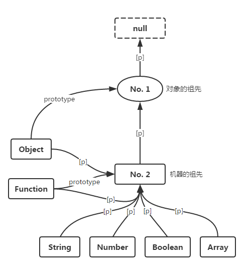
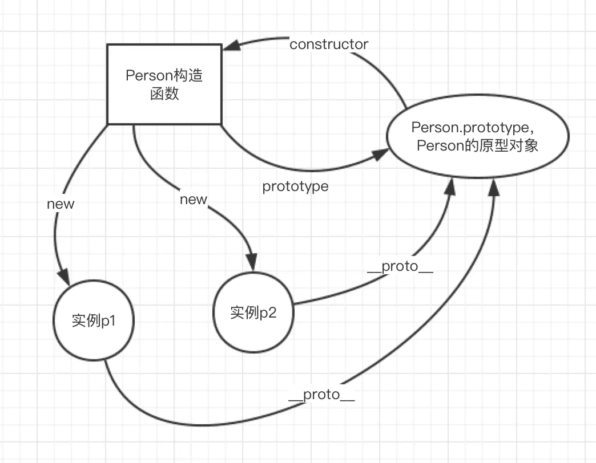

# 构造函数、原型对象实例


## 一、原型对象实例

每一个函数，都有一个 `prototype` 属性

所有的引用类型默认都是继承 `Object` 。

```
Object.prototype.__proto__ === null;

Object.prototype===Object.__proto__.__proto__;

Function.prototype===Function.__proto__===Object.__proto__ ;

Function.prototype.__proto__ === Object.prototype;
```



```
p代表__proto__  ，
No.2=ƒ () { [native code] }   ,
No.1=[constructor: ƒ, concat: ƒ, find: ƒ, findIndex: ƒ, pop: ƒ, …]
```

## 二、构造函数、原型对象、实例之间的关系





## 三、new 的过程

* 新生成了一个对象
* 链接到原型
* 绑定 `this`
* 返回新对象