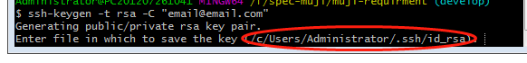

#SSH

## 1. 概念

`SSH` 为 [Secure Shell](https://baike.baidu.com/item/Secure%20Shell) 的缩写，由 `IETF` 的网络小组（`Network Working Group`）所制定；`SSH` 为建立在应用层基础上的安全协议。`SSH` 是目前较可靠，专为远程登录会话和其他网络服务提供安全性的协议。利用 `SSH` 协议可以有效防止远程管理过程中的信息泄露问题。`SSH`最初是UNIX系统上的一个程序，后来又迅速扩展到其他操作平台。`SSH`在正确使用时可弥补网络中的漏洞。`SSH`客户端适用于多种平台。几乎所有UNIX平台—包括、`Linux`以及其他平台，都可运行`SSH`。


## 2. 安全验证

SSH验证：从客户端来看，SSH提供两种级别的安全验证。

**第一种级别（基于口令的安全验证）**

只要你知道自己帐号和口令，就可以登录到远程主机。所有传输的数据都会被加密，但是不能保证你正在连接的服务器就是你想连接的服务器。可能会有别的服务器在冒充真正的服务器，也就是受到“中间人”这种方式的攻击。

**第二种级别（基于密匙的安全验证）**

需要依靠密匙，也就是你必须为自己创建一对密匙，并把公用密匙放在需要访问的服务器上。如果你要连接到SSH服务器上，客户端软件就会向服务器发出请求，请求用你的密匙进行安全验证。服务器收到请求之后，先在该服务器上你的主目录下寻找你的公用密匙，然后把它和你发送过来的公用密匙进行比较。如果两个密匙一致，服务器就用公用密匙加密“质询”（challenge）并把它发送给客户端软件。客户端软件收到“质询”之后就可以用你的私人密匙解密再把它发送给服务器。
用这种方式，你必须知道自己密匙的口令。但是，与第一种级别相比，第二种级别不需要在网络上传送口令。


## 3. 命令

### 3.1 查看当前电脑所有的`ssh`:`ls -al ~/.ssh`

### 3.2 一台电脑上github和gitlab配置ssh


* 如果没有生成过`.ssh`文件，就要执行 `$ ssh-keygen -t rsa -C "email@email.com"` 来创建`.ssh`，如果当前是为`github`生成，使用`github`的邮箱，如果是`gitlab`则输入`gitlab`的邮箱;
* 下面你会看到下图，如果只是配置一个`github`或者`gitlab` 直接回车就可以了，如果是想同时配置则需要修改生成的`id_rsa`，以上面为例子，可以输入 `/c/Users/Administrator/.ssh/github_id_rsa` 后回车,这里的`github_id_rsa`你可以自己去定义

* 接下来直接回车就ssh的秘钥就生成了
* 如果是自己输入了秘钥名称则需要配置一个config文件,里面配置如下(其中.ssh目录如下)
    
  ```
    # gitlab
    Host gitlab.com
        HostName gitlab.com
        PreferredAuthentications publickey
        IdentityFile ~/.ssh/id-rsa
    # github
    Host github.com
        HostName github.com
        # User WebMrYang
        PreferredAuthentications publickey
        IdentityFile ~/.ssh/github_id_rsa
  ```
* 当完成以上的`ssh`秘钥生成后，我们就可以给`github`或者`gitlab`来配置公钥了，公钥的后缀是`.pub`,复制`.pub`文件中的公钥，登陆你的github帐户。点击你的头像，然后 `Settings` -> 左栏点击 `SSH and GPG keys` -> 点击 `New SSH key`新建公钥`title`可以随便输key就是你刚刚新建的公钥
* 可以测试下 `ssh git@github.com`如果输出`Hi xxx! You've successfully authenticated, but GitHub does not # provide shell access. Connection to github.com closed.`说明成功了如图：


    


