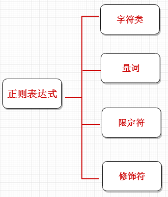

# 正则的组成



## 1. 字符类

|   字符 | 描述  |
|   -   |   -  |
|   <span 1 style="color:red">\</span>   |   将下一个字符标记为一个特殊字符、或一个原义字符、或一个 向后引用、或一个八进制转义符。例如，`n` 匹配字符 `n`。`\n` 匹配一个换行符。序列 `\\` 匹配 `\` 而 `\(` 则匹配 `(`。      |
|   <span 1 style="color:red">\d</span>   |   匹配一个数字字符。等价于 `[0-9]`。      |
|   <span 1 style="color:red">\D</span>   |   匹配一个非数字字符。等价于 `[^0-9]`。    |
|   <span 1 style="color:red">\w</span>   |   匹配字母、数字、下划线。等价于 `[A-Za-z0-9_]`。        |
|   <span 1 style="color:red">\W</span>   |   匹配非字母、数字、下划线。等价于 `[^A-Za-z0-9_]`。      |
|   <span 1 style="color:red">**.**</span>   |   匹配除换行符（`\n`、`\r`）之外的任何单个字符。    |
|   <span 1 style="color:red">.</span>   |   匹配除换行符（`\n`、`\r`）之外的任何单个字符。    |
|   <span 1 style="color:red">[xyz]</span>   |   字符集合。匹配所包含的任意一个字符。例如， `[abc]` 可以匹配 `plain` 中的 `a`。        |
|   <span 1 style="color:red">`[^xyz]`</span>   |   负值字符集合。匹配未包含的任意字符。例如， `[^abc]` 可以匹配 "plain" 中的`p`、`l`、`i`、`n`。        |
|   <span 1 style="color:red">[a-z]</span>   |   字符范围。匹配指定范围内的任意字符。例如，`[a-z]` 可以匹配 `a` 到 `z` 范围内的任意小写字母字符。        |
|   <span 1 style="color:red">`[^a-z]`</span>   |   	负值字符范围。匹配任何不在指定范围内的任意字符。例如，'[^a-z]` 可以匹配任何不在 `a` 到 `z` 范围内的任意字符。        |
|   \s  |   匹配任何空白字符，包括空格、制表符、换页符等等。等价于 `[ \f\n\r\t\v]` 。        |
|   \S   |   匹配任何非空白字符。等价于 `[^\f\ [^ \f\n\r\t\v]`。      |


## 2. 量词

量词：在正则中表现出现次数的

|   字符 | 描述  |
|   -   |   -  |
|   <span 1 style="color:red">*</span>   |   匹配前面的子表达式零次或多次。例如，zo* 能匹配 "z" 以及 "zoo"。* 等价于{0,}。|  
|   <span 1 style="color:red">+</span>   |   匹配前面的子表达式一次或多次。例如，'zo+' 能匹配 "zo" 以及 "zoo"，但不能匹配 "z"。+ 等价于 {1,}。  |
|   <span 1 style="color:red">?</span>   |   匹配前面的子表达式零次或一次。例如，"do(es)?" 可以匹配 "do" 、 "does" 中的 "does" 、 "doxy" 中的 "do" 。? 等价于 {0,1}。|
|   <span 1 style="color:red">{n}</span>|   n 是一个非负整数。匹配确定的 n 次。例如，'o{2}' 不能匹配 "Bob" 中的 'o'，但是能匹配 "food" 中的两个 o。 |
|   <span 1 style="color:red">{n,}</span>    |   n 是一个非负整数。至少匹配n 次。例如，'o{2,}' 不能匹配 "Bob" 中的 'o'，但能匹配 "foooood" 中的所有 o。'o{1,}' 等价于 'o+'。'o{0,}' 则等价于 'o*'。  |
|   <span 1 style="color:red">{n,m}</span>	|   m 和 n 均为非负整数，其中n <= m。最少匹配 n 次且最多匹配 m 次。例如，"o{1,3}" 将匹配 "fooooood" 中的前三个 o。'o{0,1}' 等价于 'o?'。请注意在逗号和两个数之间不能有空格。    |


## 3. 位置限定符

|   字符  | 描述  |
|   -    |   -  |
|   <span 1 style="color:red">^</span>    |   匹配输入字符串的开始位置。如果设置了 RegExp 对象的 Multiline 属性，^ 也匹配 '\n' 或 '\r' 之后的位置。      |
|   <span 1 style="color:red">$</span>    |   匹配输入字符串的结束位置。如果设置了RegExp 对象的 Multiline 属性，$ 也匹配 '\n' 或 '\r' 之前的位置。
    |
|   <span 1 style="color:red">\b</span>   |   匹配一个单词边界，也就是指单词和空格间的位置。例如， 'er\b' 可以匹配"never" 中的 'er'，但不能匹配 "verb" 中的 'er'。 |
|<span 1 style="color:red">\B </span>  |   匹配非单词边界。'er\B' 能匹配 "verb" 中的 'er'，但不能匹配 "never" 中的 'er'。    |
|<span 1 style="color:red">\n</span>   |   匹配一个换行符。等价于 \x0a 和 \cJ。    |
|   <span 1 style="color:red">\r</span>   |   匹配一个回车符。等价于 \x0d 和 \cM。    |
|   <span 1 style="color:red">\t</span>   |   匹配一个制表符。等价于 \x09 和 \cI。 |
|   \v   |   匹配一个垂直制表符。等价于 \x0b 和 \cK。    |
|   \f   |   匹配一个换页符。等价于 \x0c 和 \cL。    |
|   \cx  |   匹配由 x 指明的控制字符。例如， \cM 匹配一个 Control-M 或回车符。x 的值必须为 A-Z 或 a-z 之一。否则，将 c 视为一个原义的 'c' 字符。 |


## 5. 正则修饰符

|   字符 | 描述  |
|   -   |   -  |
|   <span 1 style="color:red">i</span>   |   忽略大小写    |
|   <span 1 style="color:red">m</span>   |   表示可以进行多行匹配，一般和$,^配合使用 |
|   <span 1 style="color:red">g </span>  |   全局查询    |
|   <span 1 style="color:red">s</span>   |   将字符串视为单行，换行符作为普通字符    |

    ```
        // i 使用
        var str="bAcd";
        console.log(str.match(/a/i))
        //如果不适用i不会匹配，使用i，忽略大小写，会匹配上A


        // g 使用
        var str="abAcd";
        console.log(str.match(/a/gi))
        //如果不适用g只会匹配上{a}，使用g，全局查询会匹配上[a,A]


        // m 使用
        var str="bd76dfsdfsdfsdfs\r\nb76dsfsdb8fsdf";
        console.log(str.match(/^b./gm));
        //如果不适用m只会匹配上{bd}，使用m表明可以进行多行匹配，全局查询会匹配上[bd,b7]


        // s 使用
        var str="sbcpr\nydddpray";
        console.log(str.match(/pr.y/gs));
        //如果不适用s只会匹配上{pray}，使用m表明可以进行多行匹配，全局查询会匹配上[pr\ny,pray]

    ```

 

